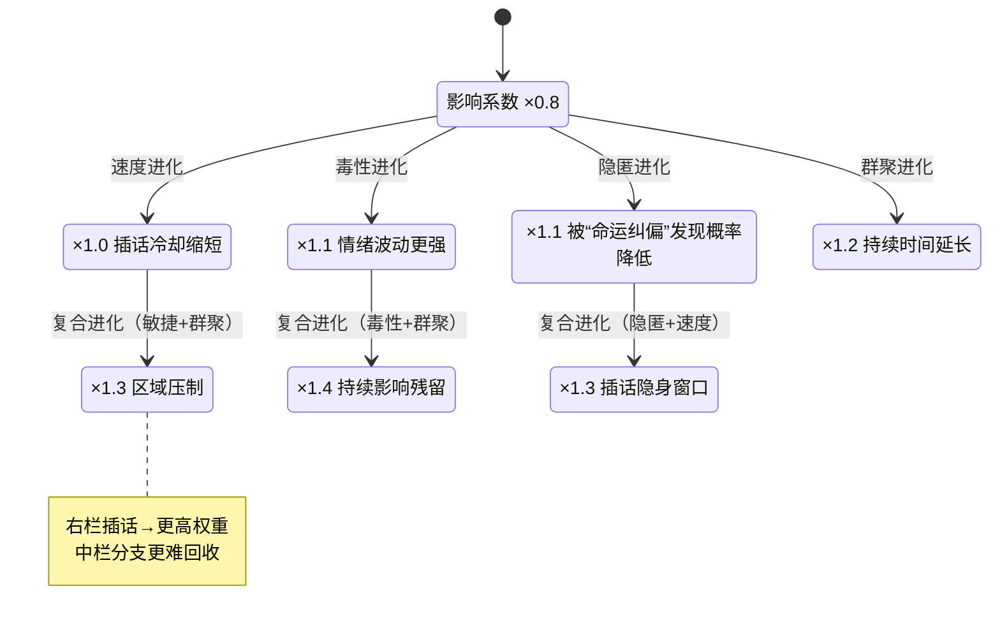

### 三栏横屏游戏 UI 线框与流程（Wireframe & Flow）

- 设备支持：手机横屏、平板、PC（不支持手机竖屏）
- 视觉与交互主旨：左（自然意志/全知视角）- 中（玩家命运/对话主场）- 右（插话/干扰）
- 核心机制：左栏为“命运主线”，中栏对话默认遵循；玩家可用右栏插话（文本/AI建议/长按语音）造成微小偏移。蚊子进化后，插话影响力增强；老鹰为隐藏 BOSS，随偏移累积逐步显形。

---

### 1) 布局线框（横屏 16:9 基准）
```
┌───────────────────────────────────────────────────────────────────────────────┐
│                              横屏 · 三栏瀑布流                               │
├───────────────────────────────┬───────────────────────────────┬──────────────┤
│ 左栏 · 世界关键事件（25%）    │ 中栏 · 玩家对话主场（50%）    │ 右栏 · 插话/干扰（25%） │
│ - 纵向卡片时间线（瀑布感）   │ - 群聊对话气泡垂直流          │ - 上：AI建议列表        │
│ - 自动刷新/轻闪烁高亮         │ - 顶部可显示触发事件          │ - 下：长按语音按钮      │
│ - 只读象征全知/自然意志       │ - 底部输入：文本 + 语音        │ - 插话成功→轻微偏移      │
│                               │ - 左下：老鹰按钮（宏观视角）   │ - 进化后影响力更强      │
│                               │ - 右下：蚊子按钮（进化菜单）   │                          │
├───────────────────────────────┴───────────────────────────────┴──────────────┤
│ 适配：PC/平板 25-50-25 固定；手机横屏优先中栏 60-80%，左右折叠为图标抽屉         │
└───────────────────────────────────────────────────────────────────────────────┘
```

- 色彩区分：
  - 左栏：冷色（蓝灰/青绿）半透明底，历史/自然材质（云雾/羊皮纸）
  - 中栏：中性灰，文本对比高，背景略暗
  - 右栏：暖色（橙黄/红棕），体现“干预感”
- 字体：
  - 标题/时间节点：笔触感衬线
  - 对话：高可读无衬线

---

### 2) 关键交互动效（时序与反馈）
- 左→中：世界事件新卡片“闪烁 0.2s”后，中栏顶部生成对应话题触发；对话项目“滑入 0.4s”。
- 插话分支：右栏插话成功时，中栏出现“短分支动画 0.5s”，随后回归主线（除非干扰积累超过阈值）。
- 老鹰/蚊子：
  - 老鹰点击→宏观地图/势力分布弹窗；偏移累积后图标偶现“血色瞳孔”闪烁。
  - 蚊子点击→进化面板（毒性/速度/隐匿/群聚）；进化后右栏插话效果更强。

动效节奏（建议）：
- 事件卡片滑入：0.4s
- 插话区提示闪动：0.2s
- 对话分支展开：0.5s（延迟后收束）

---

### 3) 响应式适配
- PC：三栏比例固定 25%-50%-25%，左右留边
- 平板：同 PC 比例，字体 +10%~15%
- 手机（横屏）：中栏优先 60%~80%，左右折叠为图标/抽屉式，点击弹出覆盖层
- 竖屏：不支持 → 显示“请旋转横屏”遮罩

---

### 4) 隐藏设定可视化（老鹰 BOSS / 蚊子进化）

- 老鹰（隐藏 BOSS）
  - 初期：左下角静态/轻振翅；文案偏守望者气质（如“世界尽收眼底”）
  - 暴露：插话偏移累积后，图标偶现血色瞳孔/暗纹；宏观地图中势力范围扩张
  - 对抗：进入 BOSS 阶段 → 图标替换为全屏演出

- 蚊子（可进化，后期可取代“老虎”势力）
  - 初期：右下角微小宠物；“微小扰动”菜单（偷听/刺探/轻干扰）
  - 进化：分支解锁（毒性/速度/隐匿/群聚）；图标逐步精致/发光/器官变化
  - 终局：图标巨大化+王冠/虎纹；世界势力改写；NPC 对话出现“成群嗡嗡声”的暗示

---

### 5) Mermaid · 叙事-交互-反馈流程
```mermaid
flowchart LR
  A[左栏·世界事件\n命运主线] -- 闪烁触发 --> B[中栏·对话主场\n默认跟随主线]
  B -- 玩家点击右栏AI建议/文本 --> C{插话成功?}
  C -- 是 --> D[分支动画0.5s\n轻微偏移]
  C -- 否 --> B
  D --> E{干扰积累≥阈值?}
  E -- 否：回归主线 --> B
  E -- 是：产生支线 --> F[新事件写入左栏]
  F --> B

  subgraph 生物要素
    M[蚊子·进化面板]\n(毒/速/隐/群)
    H[老鹰·宏观地图]\n(势力扩张提示)
  end

  D -. 影响力加成 .-> M
  D -. 偏移警戒 .-> H
```

---

### 6) Mermaid · 蚊子进化与插话影响强度


---

### 7) UI 文案与动效细节（摘选）
- 插话按钮提示：
  - AI 建议就绪 → “可插话（Tab/点按）”闪动 0.2s
  - 长按语音 → 中栏出现“暂停”遮罩与波形动画
- 老鹰提示（偏移警戒）：“天空的影子变得更近了。”
- 蚊子进化提示：“你的嗡鸣更难被忽视。”

---

### 8) 前端落地对照（与原型文件一致）
- DOM/区域命名（示例）：
  - 左栏：`#world-events`
  - 中栏：`#chat-stream`、输入区 `#composer`、遮罩 `#chat-pause-overlay`
  - 老鹰按钮：`#btn-eagle`
  - 蚊子按钮：`#btn-mosquito`
  - 右栏：`#interject-panel`、AI 建议 `button.interject-suggest`、语音长按 `#btn-voice`

---

附：低保真可交互原型见 `/workspace/prototype-3col.html`（支持 PC/平板/手机横屏，竖屏会给出不支持提示）。